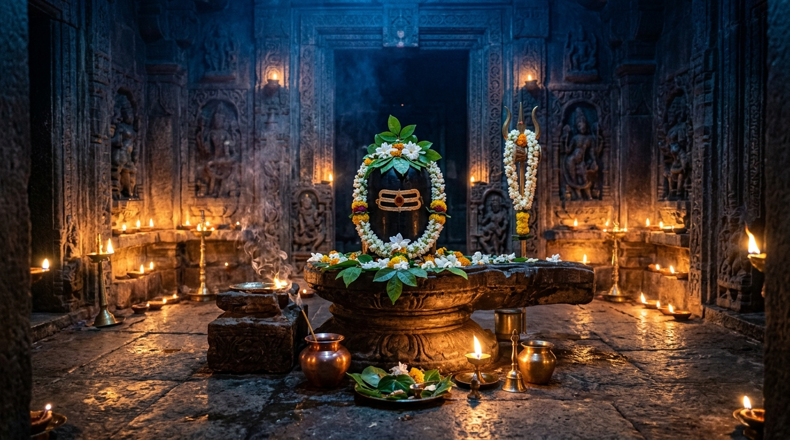
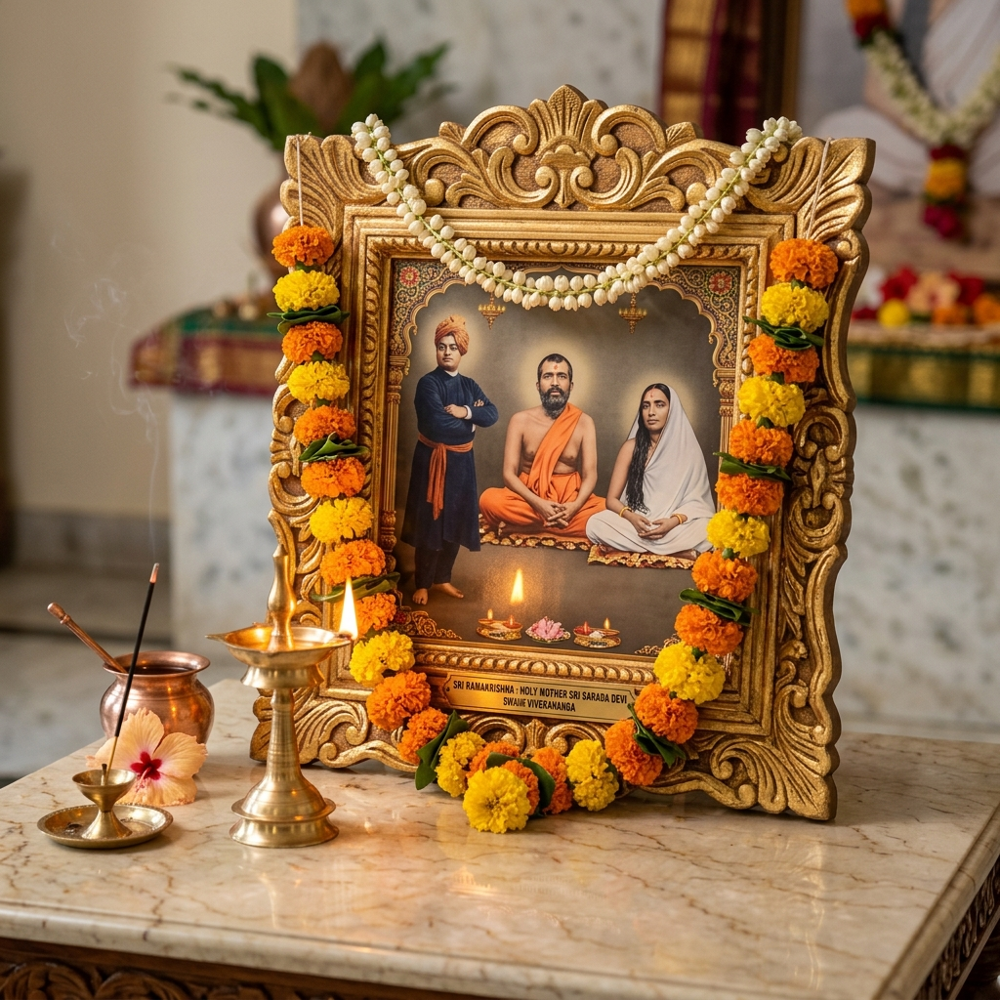

<div align="center">

  

  # 🌺 করুণাময়ী মা সারদা | Karunamoyee Ma Sarada

  <p align="center">
    <strong>A Sacred & Modern Progressive Web Application Dedicated to Holy Mother Sri Sarada Devi, Sri Ramakrishna Paramahamsa, and Swami Vivekananda</strong>
  </p>

  <p align="center">
    <a href="https://masarada.vercel.app" target="_blank">
      
    </a>
  </p>

  [](https://nextjs.org/)
  [](https://react.dev/)
  [](https://www.typescriptlang.org/)
  [](https://tailwindcss.com/)
  [](https://www.prisma.io/)
  [](https://web.dev/progressive-web-apps/)
  [](https://masarada.vercel.app)
  [](#-copyright--license)

  <br />

  <p align="center">
    <a href="#-live-web-app">🌐 Live Web App</a> •
    <a href="#-community--devotee-impact-3000-users">👥 3000+ Devotees</a> •
    <a href="#-sacred-trio--visual-gallery">🌸 Visual Showcase</a> •
    <a href="#-key-features">✨ Key Features</a> •
    <a href="#-tech-stack">🛠️ Tech Stack</a> •
    <a href="#-project-structure">📂 Project Structure</a> •
    <a href="#-getting-started">🚀 Getting Started</a> •
    <a href="#-admin-access">🔐 Admin Access</a>
  </p>

</div>

---

## 🌐 Live Web App

Experience the application live in your browser or install it directly as a native-feel Progressive Web App (PWA):

> 🔗 **Official Website:** **[https://masarada.vercel.app](https://masarada.vercel.app)**

---

## 👥 Community & Devotee Impact (3,000+ Active Users)

Karunamoyee Ma Sarada has blossomed into a beloved spiritual digital haven, actively serving **over 3,000+ devotees, spiritual seekers, and ashram visitors** across Bengal and India.

<div align="center">

| 🕉️ Active Devotees | 📅 Bengali Calendar Views | 📖 Digital Reading Sessions | 📱 PWA Installs |
| :---: | :---: | :---: | :---: |
| **3,000+** | **28,000+** | **2,800+** | **1,850+** |
| Active monthly devotees & users | Authentic Panjika & Tithi checks | *Mayer Katha* & *Kathamrita* readers | Installed to Mobile & Desktop |

<br />

[](https://masarada.vercel.app)
[](https://masarada.vercel.app/reading)
[](https://masarada.vercel.app)

</div>

### 🌟 Why 3,000+ Devotees Choose Karunamoyee Ma Sarada

1. **Instant Morning Darshan & Tithi**: Thousands start their morning with high-resolution darshan and live Bengali Panjika tithi timings.
2. **Immersive Mayer Katha Reading**: A distraction-free, elegant reader for *Sri Sri Mayer Katha* & *Kathamrita* in pristine Bengali typography.
3. **Continuous Divine Atmosphere**: Seamless background audio player for sacred stotras, morning suprobhat, and evening arati chants.
4. **Hassle-Free Ashram Event Passes**: Instant digital QR pass generation for Jayanti festivals, Pujas, and Annakut utsavs.
5. **Direct Seva & Contribution**: Secure UPI QR integration allowing devotees everywhere to contribute to ashram annadan and seva.

### 💬 Devotee Voices & Community Feedback

> 🌸 *“Every morning, opening this web app gives me the peaceful darshan of Maa Sarada and the sacred tithi from the Panjika. It feels like visiting the ashram right from my home in Kolkata.”*  
> **— Ananya Mukherjee**, Kolkata

> 🌸 *“The background audio player and digital reading room for Sri Sri Mayer Katha are truly divine. The bilingual switcher is effortless for my elderly parents to read in Bengali.”*  
> **— Sourav Banerjee**, Bengaluru

> 🌸 *“Generating the digital QR pass for our family for the Jayanti festival was smooth and instant. A modern spiritual platform built with genuine love and devotion.”*  
> **— Debraj Ghosh**, Howrah

---

## 🌸 Sacred Trio & Visual Gallery

<div align="center">

| Holy Mother Sri Sarada Devi | Sri Ramakrishna Paramahamsa | Swami Vivekananda |
| :---: | :---: | :---: |
|  |  |  |
| *“I am the mother of the wicked, as I am the mother of the virtuous.”* | *“Truth is one; only it is called by different names.”* | *“Arise, awake, and stop not till the goal is reached.”* |

</div>

<br />

### 📸 Application Highlights & Media

<div align="center">

| Sacred Daily Darshan | Ashram Evening Arati | Shivratri Mahotsav |
| :---: | :---: | :---: |
|  |  |  |

| Spiritual Literature & Books | Puja Samagri & Store | Holy Trio & Devotional Items |
| :---: | :---: | :---: |
|  |  |  |

</div>

---

## ✨ Key Features

### 🌟 1. Sacred Darshan & Daily Bani
* **Dynamic Darshan Carousel**: Smooth auto-transitioning high-resolution portraits of Holy Mother Sri Sarada Devi.
* **Daily Bani & Teachings**: Curated inspirational quotes and universal spiritual insights.
* **Live Video Streams & Discourse**: Direct link to live ashram prayers, bhajan sessions, and discourses.

### 📅 2. Bengali Panjika & Tithi Calendar
* **Authentic Bengali Calendar**: Integrated Tithi, Nakshatra, Purnima, Amavasya, and auspicious festival dates.
* **Spiritual Event Reminders**: Real-time event notifications for Janmatithi, Pujas, and Utsavs.

### 📖 3. Sacred Reading Room (শ্রীশ্রী কথামৃত ও মায়ের কথা)
* **Digital Spiritual Library**: Read *Sri Sri Mayer Katha* (শ্রীশ্রী মায়ের কথা), *Sri Sri Ramakrishna Kathamrita* (শ্রীশ্রী রামকৃষ্ণ কথামৃত), and other foundational Ramakrishna-Vivekananda literature online.
* **Distraction-Free Reader**: Optimized font typography with Noto Sans Bengali for comfortable reading on all screen sizes.

### 🎵 4. Global Audio Player & Devotional Music
* **Continuous Background Audio**: Listen to devotional chants, stotras, and bhajans seamlessly while browsing across pages.
* **Floating Audio Player**: Persistent playback controls with play, pause, and volume controls.

### 🎟️ 5. Ashram Events & QR Pass Generation
* **Event Schedules**: Browse upcoming festivals, Annakut, Sandhya Arati, and special prayer sessions.
* **Digital Pass & QR Booking**: Book event attendance and generate scannable QR-coded entry passes.

### 🛍️ 6. Ashram Store & Sacred Bookstore
* **Spiritual E-Commerce**: Order authenticated books, pure puja samagri, chandan (sandalwood), dhoop, rudraksha, brass bell/kartal, and pure silk uttariya.
* **Cart & Seamless Checkout**: Full shopping bag management, address collection, and order generation.

### 💖 7. Online Donation (দান ও সেবা)
* **Devotional Offerings**: Seamlessly support ashram welfare, annadan (food distribution), and maintenance.
* **Instant UPI Integration**: Scannable UPI QR code and payment direct options with donation receipts.

### 🌐 8. Complete Bilingual Support (বাংলা / English)
* **One-Click Language Switcher**: Effortlessly switch entire application text, navigation, and content between Bengali (বাংলা) and English.
* **Language Context & Cookie Sync**: Persistent preference storage for returning visitors.

### 📱 9. Progressive Web App (PWA) & Mobile-First Design
* **Installable Application**: Add to Home Screen on Android, iOS, Windows, and macOS.
* **Offline Caching**: Built with `@ducanh2912/next-pwa` and Service Workers for speed and resilience.
* **Touch Optimized**: Sleek mobile bottom navigation, splash screen, and haptic feedback.

### 🔐 10. Admin Dashboard & Secure Authentication
* **Role-Based Access**: Multi-tier permissions (`USER`, `ADMIN`, `SUPER_ADMIN`).
* **NextAuth & Prisma Integration**: Secure sessions with SQLite/PostgreSQL storage.
* **Secret Gesture Launch**: Intuitive long-press gesture on the ashram logo to quickly trigger the admin portal.

---

## 🛠️ Tech Stack

| Domain | Technology / Library |
| :--- | :--- |
| **Framework** | [Next.js 16 (App Router)](https://nextjs.org/) |
| **UI & Core** | [React 19](https://react.dev/), [TypeScript](https://www.typescriptlang.org/) |
| **Styling** | [TailwindCSS v4](https://tailwindcss.com/), Custom Design Tokens, CSS Variables |
| **Typography** | [Google Fonts - Noto Sans Bengali](https://fonts.google.com/specimen/Noto+Sans+Bengali), Geist |
| **Icons** | [Lucide React](https://lucide.dev/) |
| **Database & ORM** | [Prisma ORM](https://www.prisma.io/) (SQLite / PostgreSQL ready) |
| **Authentication** | [NextAuth v5 (Beta)](https://authjs.dev/) with `@auth/prisma-adapter` & `bcryptjs` |
| **PWA & Offline** | `@ducanh2912/next-pwa`, Service Workers, Web App Manifest |
| **QR Generation** | `qrcode` |
| **Deployment** | [Vercel](https://vercel.com/) |

---

## 📂 Project Structure

```bash
karunamoyee-ma-sarada/
├── public/                 # Static assets, holy portraits, event images, store catalog & PWA icons
│   ├── logo.jpg
│   ├── maa-sarada-portrait.png
│   ├── ramakrishna.png
│   ├── swami-vivekananda.jpg
│   ├── event-*.jpg
│   ├── shop-*.jpg
│   └── manifest.json
├── src/
│   ├── app/                # Next.js App Router pages
│   │   ├── about/          # Life & teachings of the Holy Trinity
│   │   ├── account/        # User profile & credentials
│   │   ├── admin/          # Admin management portal
│   │   ├── api/            # API routes (Auth, Orders, Tickets, Events)
│   │   ├── cart/           # Shopping cart
│   │   ├── checkout/       # Checkout flow
│   │   ├── donate/         # UPI donation & seva offerings
│   │   ├── events/         # Ashram events & QR ticket passes
│   │   ├── gallery/        # High-resolution sacred image gallery
│   │   ├── panjika/        # Bengali Panjika & Tithi calendar
│   │   ├── reading/        # Sri Sri Mayer Katha & Kathamrita
│   │   ├── shop/           # Spiritual bookstore & puja store
│   │   ├── videos/         # Live darshan & devotional videos
│   │   ├── layout.tsx      # Global shell, Providers, Audio & Navigation
│   │   └── page.tsx        # Homepage, Darshan slider, Quick links
│   ├── components/         # Reusable modular UI components
│   │   ├── common/         # Splash screens, PWA prompt, modals
│   │   ├── layout/         # Bottom navigation, language toggle, header
│   │   └── media/          # Global audio player & context
│   └── lib/                # Internationalization (i18n), Theme & Prisma client
│       ├── i18n/           # Bengali & English dictionaries
│       └── prisma.ts       # Database singleton
├── prisma/
│   └── schema.prisma       # Database schema (User, Session, Event, Ticket, Order)
├── package.json
└── README.md
```

---

## 🚀 Getting Started

Follow these steps to run the application locally on your computer:

### Prerequisites
* **Node.js**: Version `18.18+` or `20+` recommended
* **npm**, **yarn**, or **pnpm**

### 1. Clone the Repository
```bash
git clone https://github.com/tanmaybariik/masarada.git
cd masarada
```

### 2. Install Dependencies
```bash
npm install
```

### 3. Setup Environment Variables
Create a `.env` file in the root directory:
```env
DATABASE_URL="file:./dev.db"
NEXTAUTH_SECRET="your-super-secret-nextauth-key"
NEXTAUTH_URL="http://localhost:3000"
```

### 4. Initialize Database
```bash
npx prisma db push
```

### 5. Start Development Server
```bash
npm run dev
```

Open [http://localhost:3000](http://localhost:3000) with your browser to experience the application.

---

## 🔐 Admin Access

The application features a secure administration portal for managing ashram events, checking tickets, and handling shop orders:

1. **Direct URL**: Navigate to `/admin` or `/login`.
2. **Hidden Gesture**: Press and hold (touch or click) the ashram logo in the header for **1.5 seconds** to trigger the dashboard transition with haptic feedback.

---

## 📱 Mobile App Installation (PWA)

1. Open **[https://masarada.vercel.app](https://masarada.vercel.app)** on your mobile phone (Chrome on Android or Safari on iOS).
2. Tap the **"Add to Home Screen"** or **"Install App"** prompt.
3. Launch the app in fullscreen mode with offline access.

---

## 🔒 Copyright & License

**Copyright © 2026 Tanmay Barik. All Rights Reserved.**

This software, its source code, design assets, and associated documentation are proprietary and confidential. This is not an open-source project. Unauthorized copying, distribution, modification, reverse engineering, reproduction, or deployment of any part of this repository without prior explicit written permission is strictly prohibited.

---

<div align="center">

  **“ভালোবাসা দিয়েই মানুষকে আপন করে নিতে হয়, পরকে আপন করতে হয়।”**  
  *— শ্রীশ্রী মা সারদা দেবী*

  <br />

  Made with devotion and care for devotees worldwide 🙏
  
  **[Visit Live Site: masarada.vercel.app](https://masarada.vercel.app)**

</div>
